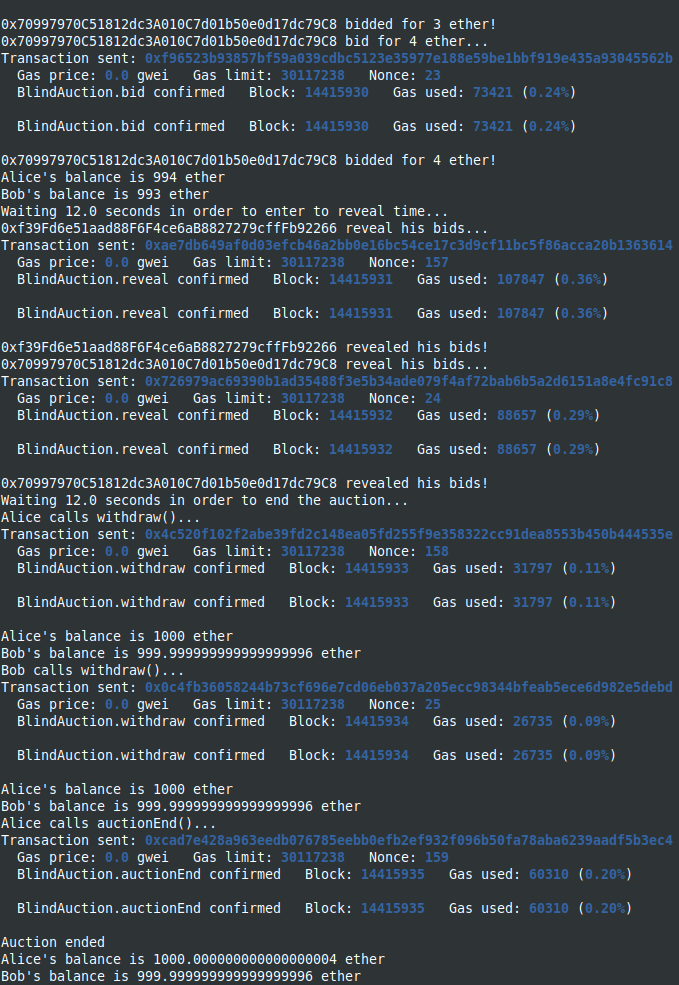
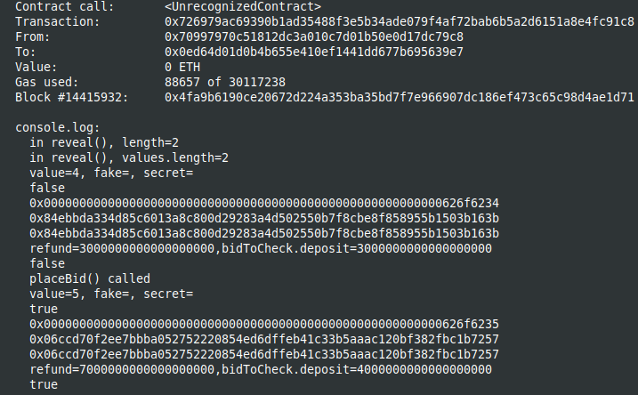

Study case of the Auction contracts, from [Solidity documentation, Blind Auction](https://docs.soliditylang.org/en/latest/solidity-by-example.html#blind-auction)

I use brownie to compile and deploy into hardhat in order to have the console.log feature.
You should start the hardhat node in another terminal and folder (`hh node`), then, in a terminal :

```bash
brownie compile
brownie run scripts/deploy.py
```

Brownie has a module for dealing with encoding data between python types and Solidity types.

```python
from brownie import convert
```

When encoding data for using it with web3.solidityKeccak function, it is important to
correctly encode the values sent to the function using the convert module.

Here, we call the encoding function in python, with the following values:
\_values=1
\_fakes=True
\_secrets="secret1".encode("utf-8")

In python (brownie deployment script), we call the solidityKeccak function as follows:

```python
sk = web3.solidityKeccak(["uint256", "bool", "bytes32"],
[convert.to_uint(_values, "uint256"), convert.to_bool(_fakes),
web3.toHex(convert.to_bytes(_secrets, "bytes32"))])
```

This way, the python variables values are correctly converted to Solidity types, in order to obtain the same hash in python and in Solidity.

After deploying from brownie :


The result in the hardhat console :


