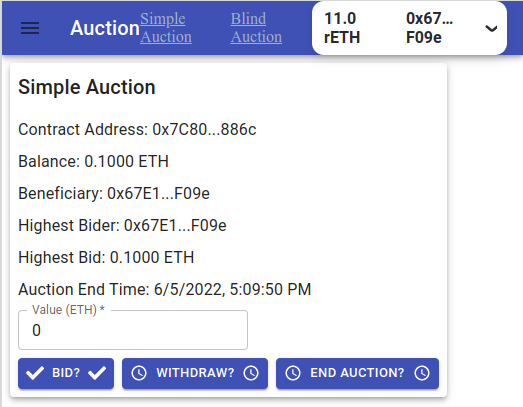

# Fullstack Ethereum React Application for the Auction contracts

Study case of the Auction contracts, from [Solidity documentation, Simple Auction](https://docs.soliditylang.org/en/latest/solidity-by-example.html#simple-open-auction)
and
[Solidity documentation, Blind Auction](https://docs.soliditylang.org/en/latest/solidity-by-example.html#blind-auction)

## Frontend on the Rinkeby Testnet

The application is live on Netlify with the Ballot contract deployed on Rinkeby

https://auctionfullstack.netlify.app/




## Quickstart

### `npm install`

```bash
npm install
```

To install the required packages.

### `configure .env`

Configure .env file in the auction folder.
An example of .env file :

```bash .env
UPDATE_FRONT_END=yes
```

### `start hardhat`

Please make sure to start hardhat from the auction folder in one terminal

```bash
npx hardhat node
```

### `add hh-local`

Then go to another terminal and add hh-local as a permanent network in brownie

```bash
brownie networks add Ethereum hh-local host=http://127.0.0.1 chainid=31337
```

### `deploy on hh-local`

Modify client/src/index.js to include the chain.hardhat. Uncomment the hardhat line:

```
const { chains, provider } = configureChains(
  [
    //chain.hardhat,
    chain.rinkeby,
  ],
  [alchemyProvider({ alchemyId: process.env.ALCHEMY_ID }), publicProvider()]
);
```

The deployment of SimpleAuction and BlindAuction contracts use a bidding time and reveal time of 1 hour.
You can change these values in the deployment scripts.

In the same auction folder, deploy the contracts :

```bash
brownie run scripts/deploySimpleAuction.py --network hh-local
brownie run scripts/deployBlindAuction.py --network hh-local
```

### `configure and start the client app`

Go to the client folder, install dependencies, configure .env file and start the app

### `npm install`

To install the required packages.

```bash
npm install
```

### `configure .env`

Configure .env file in the client folder.
An example of .env file :

```bash .env
GENERATE_SOURCEMAP=false
```

### `start the application`

```bash
npm start
```

Runs the app in the development mode.\
Open [http://localhost:3000](http://localhost:3000) to view it in your browser.
