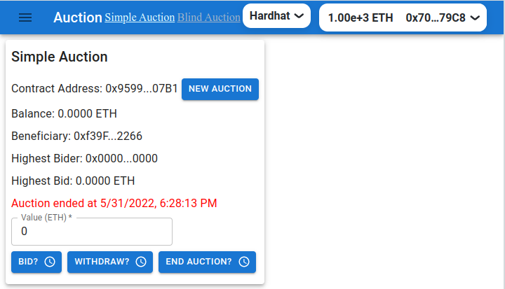

# Client Application for the Simple Auction contract

## Live client application

The client application is deployed on Netlify/Rinkeby.

https://to-be-deployed.netlify.app/



## Quickstart

### `npm install`

To install the required packages.

### `configure .env`

Configure .env file in the client folder
An example of .env file :

```bash .env
GENERATE_SOURCEMAP=false
ALCHEMY_ID="your-api-key"
REACT_APP_RINKEBY_URL="https://eth-rinkeby.alchemyapi.io/v2/your-api-key"
REACT_APP_GRAPH_URL="https://api.studio.thegraph.com/query/24949/multisign_wallet/0.0.1"
```

### `start the application`

```bash
npm start
```

Runs the app in the development mode.\
Open [http://localhost:3000](http://localhost:3000) to view it in your browser.

You can switch the networks between hardhat and rinkeby.

## Subgraph simple_auction deployed on The Graph studio

In the client/src folder there is a `graphsimpleAuction` folder containing the deployement
of the SimpleAuction contract on the Rinkeby network.
